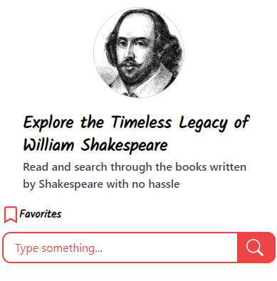

# Shakesearch Frontend

Take-home challenge from [Pulley.com](https://pulley.com/) when interviewing senior software engineers.

Shakesearch (the name of the app) a simple web app that allows a user to search for a text string in the complete works of Shakespeare. In it's current state, however, the app is in rough shape. The search is case sensitive, the results are difficult to read, and the search is limited to exact matches.

Your Mission: Improve the app! Think about the problem from the user's perspective and prioritize your changes according to what you think is most useful. The company expect to evaluate submissions primarily based on how well the search works for users.

**Team Epsilon's capstone project for the [TalentQL Pipeline](https://pipeline.talentql.com/) V2 2022/2023**

## Screenshots



## Run Locally

Clone the project

```bash
  git clone https://github.com/PipelineV2/team-epsilon-shakesearch
```

Go to the project directory

```bash
  cd team-epsilon-shakesearch
```

Install dependencies

```bash
  yarn install
```

Start the server

```bash
  yarn run dev
```

## Features

- Matching text highlighting 
- Favorites
- History/Keywords/Suggestions 
- Typing predictions 
- Dynamic placeholder - random display of play names
- Offline capabilities 
- Responsive design

## Tech Stack

**Client:** React, Fuse JS, TailwindCSS, Vite

## License

[MIT](https://choosealicense.com/licenses/mit/)
